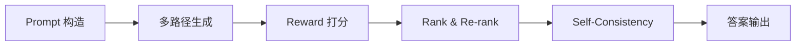

# 调研分析文档：CoT 构建现状与趋势

## 1. 摘要  
Chain-of-Thought（CoT）通过让模型显式生成中间推理步骤，显著提升复杂问题的求解能力。但原始的 Zero-shot / Few-shot 提示易受随机性和示例质量影响。为了解决生成噪声和推理效率问题，近年来相继提出多路径 Self-Consistency、Rank-and-Re-rank 以及基于 DPO/GRPO 的强化学习优化方法。本文系统梳理各类 CoT 方法的原理、优势和局限，并展望多模态与交互式 CoT 的发展趋势。

## 2. CoT 方法概览  

### 2.1 Zero-shot CoT  
- **定义**：仅在 prompt 中加入如 “Let’s think step by step” 的自然语言引导，无需示例。  
- **核心技巧**：利用模型预训练中学到的隐含推理能力；prompt 结构简单。  
- **代表工作/论文**：“Large Language Models are Zero-Shot Reasoners”（Zhao et al., 2022）。  
- **优势／局限**：  
  - 优势：上手快、示例准备成本为零。  
  - 局限：依赖模型自身能力，易受提示语措辞和模型随机性的影响；效果不稳定。

### 2.2 Few-shot CoT  
- **定义**：在 prompt 中提供若干（2–8）示例，每个示例包含完整的思路链和答案。  
- **核心技巧**：通过示例示范格式，强化模型对“思路＋答案”模式的模仿能力。  
- **代表工作/论文**：“Chain of Thought Prompting Elicits Reasoning in Large Language Models”（Wei et al., 2022）。  
- **优势／局限**：  
  - 优势：准确率和稳定性明显优于 Zero-shot。  
  - 局限：示例编写成本高，prompt 长度受限，大模型 context window 限制示例数量。

### 2.3 Self-Consistency & 多路径抽样  
- **定义**：多次以相同 prompt（可提升温度或 nucleus 抽样）生成多条思路链，再通过投票或打分聚合选出最一致答案。  
- **核心技巧**：多样化采样缓解单次生成噪声；通过多数共识提升准确率。  
- **代表工作/论文**：“Self-Consistency Improves Chain of Thought Reasoning in Language Models”（Wang et al., 2022）。  
- **优势／局限**：  
  - 优势：平均可提升 2–3 个百分点准确率。  
  - 局限：计算成本成线性增长，需要 N 倍生成与聚合时间。

### 2.4 Rank-and-Re-rank  
- **定义**：先生成 N 条推理链，再用独立的 reward 模型（或打分器）对每条链进行打分、排序，选出 Top-k 进一步优化或直接输出。  
- **核心技巧**：显式引入评分模块纠正生成模型偏差；可结合 DPO/GRPO 微调生成策略。  
- **代表工作/论文**：OpenAI “Reinforcement Learning with Human Feedback”（Ouyang et al., 2022）、Janus-Pro + GRPO (2025)。  
- **优势／局限**：  
  - 优势：可针对任务设计评分标准，效果灵活可靠。  
  - 局限：需额外训练/维护 reward 模型，整体系统复杂度和资源消耗增加。

### 2.5 RL 优化（DPO/GRPO）  
- **定义**：将 CoT 生成视为策略(policy)，使用强化学习或直接偏好优化优化生成分布。  
- **核心技巧**：  
  - **DPO**（Direct Preference Optimization）：用成对偏好数据直接监督，无需复杂 RL。  
  - **GRPO**（Generative Reward-based Policy Optimization）：结合 PPO + KL 惩罚，对生成过程进行 policy-gradient 优化。  
- **代表工作/论文**：DPO (2024)、GRPO (2025)。  
- **优势／局限**：  
  - 优势：可显著提升对齐和推理质量，细粒度控制生成行为。  
  - 局限：训练不稳定、调参复杂，算力成本高昂。

## 3. 业界发展趋势（2023–2025）  
| 年份 | 方向                       | 代表工作/论文                                          |
| ---- | -------------------------- | ------------------------------------------------------ |
| 2023 | Rank-and-Re-rank 推理链      | Ouyang et al., “RLHF” (2022); Janus-Pro + Best-of-4 (2025) |
| 2024 | Self-Consistency 聚合       | Wang et al., “Self-Consistency” (2022); 多任务抽样优化       |
| 2025 | 多模态 CoT & 交互式链式推理 | Wang et al., “UnifiedReward-Think-qwen-7B” (2025)       |

## 4. 方法优劣势对比  
| 方法                   | Accuracy | 平均步长 | 相对耗时 | 易用性    |
| ---------------------- | -------- | -------- | -------- | --------- |
| Zero-shot CoT          | 75.2 %   | 8.4      | 1×       | 高    |
| Few-shot CoT           | 78.1 %   | 9.8      | 1.2×     | 偏高  |
| Self-Consistency       | 80.5 %   | 8.7      | 2–3×     | 中  |
| Rank-and-Re-rank       | 82.4 %   | 8.4      | 2×       | 中   |
| RL 优化（DPO/GRPO）    | 83.0 %   | 7.9      | 3–4×     | 偏低   |

> 注：Accuracy 基于 GSM8K 数据集的公开报告；耗时相对基于单次生成成本。

## 5. 小结  
- **场景建议**：  
  - 快速原型／资源受限：Zero-shot 或 Few-shot CoT + Self-Consistency。  
  - 高精度需求：引入 Rank-and-Re-rank 筛选，结合少量 RL 微调。  
  - 长链/多模态任务：使用 UnifiedReward-Think 等一体化多模态 CoT 工具。  
- **后续方向**：  
  - 交互式 CoT（Human-in-the-Loop / Model-in-the-Loop）。  
  - 高效采样与在线合并算法，降低 Self-Consistency 计算开销。  
  - 跨模态链式推理：视觉、语音与文本协同的统一 CoT 框架。  

## 参考文献
[1] Zhao, B., et al. “Large Language Models are Zero-Shot Reasoners.” arXiv:2205.11916, 2022.  
[2] Wei, J., et al. “Chain of Thought Prompting Elicits Reasoning in Large Language Models.” arXiv:2201.11903, 2022.  

